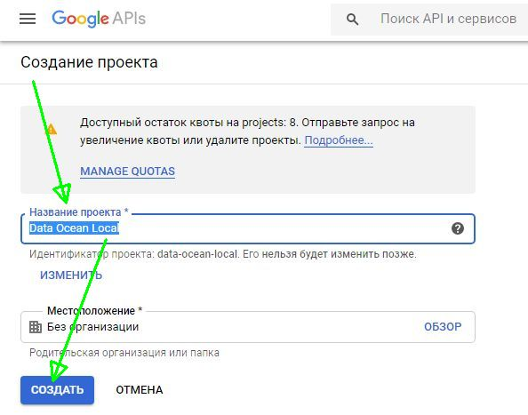
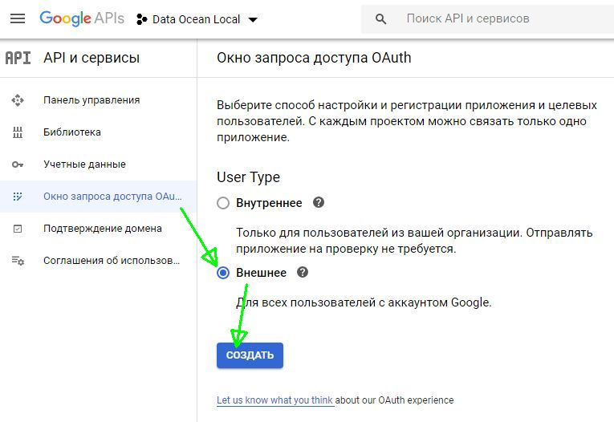
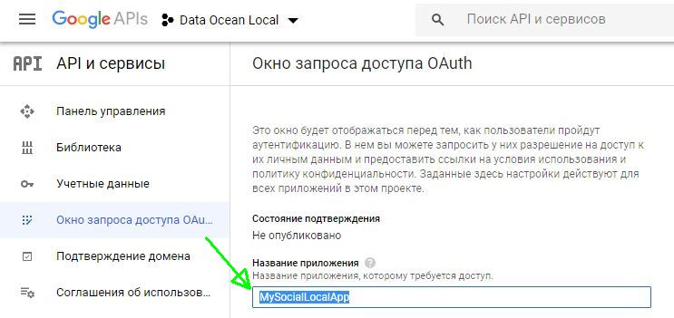
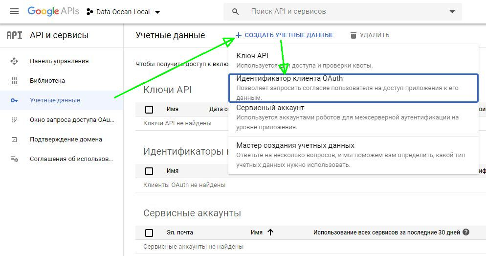
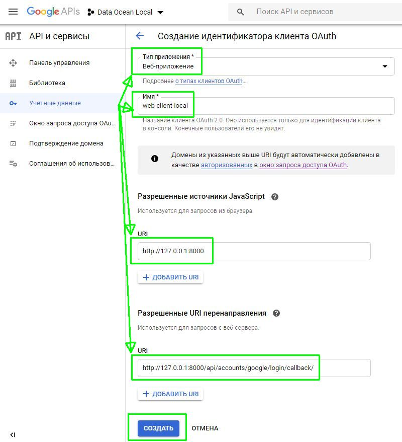
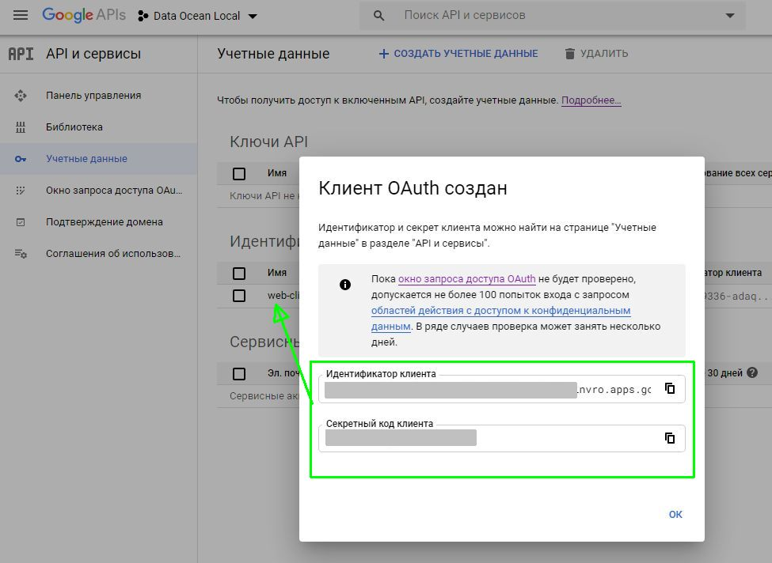
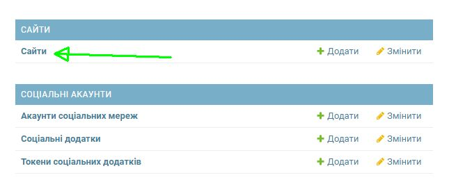
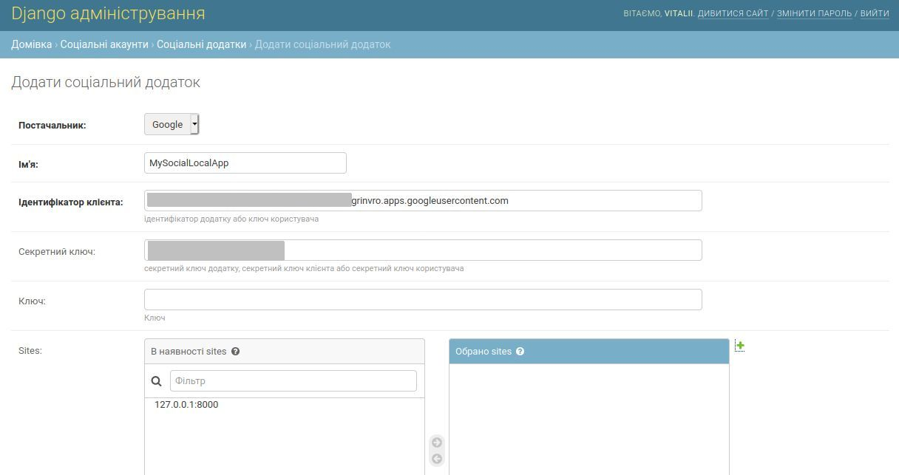
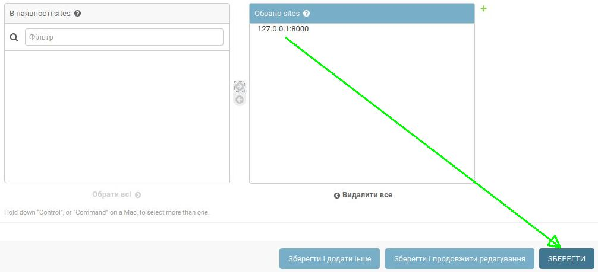

# Data Ocean

-------------------------------------------------------------------------------------------------------------------------
INSTALL ON UBUNTU 18.04 (DEV)
-------------------------------------------------------------------------------------------------------------------------

###### System update and packages install 
- $ sudo apt update && sudo apt upgrade
- $ sudo apt install dkms linux-headers-generic
- $ sudo apt install python3-setuptools python3-distutils python3-venv libpq-dev
- $ sudo apt install mc htop git

###### Install PostgreSQL
- $ sudo apt update
- $ sudo apt install postgresql postgresql-contrib
- $ psql --version

###### Create db & user
- $ sudo -u postgres psql
- postgres=# create database your_db_name;
- postgres=# create user your_db_user with password 'your_db_password';
- postgres=# grant all on database your_db_name to your_db_user;
- postgres=# /q

###### Install Python 3.7
- $ sudo apt install software-properties-common
- $ sudo add-apt-repository ppa:deadsnakes/ppa
- $ sudo apt update
- $ sudo apt install python3.7
- $ python3.7 --version
- $ sudo apt install python3.7-dev python3.7-venv

###### Create Your_Fork on GitHub from official repo 
- https://github.com/3v-workspace/Data_converter

###### Clone Your_Fork repo & create virtual environment & install requirements
- $ git clone https://github.com/Your_Fork/Data_converter.git
- $ cd Data_converter
- $ python3.7 -m venv .venv
- $ source .venv/bin/activate
- (.venv)$ pip install -U pip setuptools wheel
- (.venv)$ pip install -r requirements.txt 

###### Create your settings_local.py
- Copy **`data_converter/settings_local.base.py`** to **`data_converter/settings_local.py`**

###### Setup your settings in settings_local.py
- Setup your settings in DATABASES section 
- Setup your settings in MAIL section (if use SMTP)
- ...

###### Migrate
- (.venv)$ ./manage.py migrate

###### Create Superuser
- (.venv)$ ./manage.py createsuperuser

###### Load fixtures
- (.venv)$ ./manage.py loaddata category
- (.venv)$ ./manage.py loaddata register

###### Collect static files
- (.venv)$ ./manage.py collectstatic

###### Run server
- (.venv)$ ./manage.py runserver 127.0.0.1:8000

-----------------------------------------------------------------------------------------------------
User API endpoint
-----------------------------------------------------------------------------------------------------
- Social Login: `/api/accounts/login/`
- Social Logout: `/api/accounts/logout/`
-----------------------------------------------------------------------------------------------------
- Registration (with email send): `/api/rest-auth/registration/`
- Registration Confirm: `/api/rest-auth/registration-confirm/<int:user_id>/<str:confirm_code>/`
- Login: `/api/rest-auth/login/`
- Logout: `/api/rest-auth/logout/`
- Password Change (with old password): `/api/rest-auth/password/change/`
- Password Reset (with email send): `/api/rest-auth/password/reset/`
- New Password after Password Reset: `/api/rest-auth/password/reset/confirm/<str:UID>/<str:token>/`
-----------------------------------------------------------------------------------------------------
- User list: `/api/users/`
- User Details: `/api/rest-auth/user/`
-----------------------------------------------------------------------------------------------------

-----------------------------------------------------------------------------------------------------
Setup Redis
-----------------------------------------------------------------------------------------------------
###### Install Redis
- $ sudo apt update
- $ sudo apt install redis-server

###### Declare an init system for running Redis as a service
- $ sudo nano /etc/redis/redis.conf
  - change "supervised no" to "supervised systemd", save & exit

###### Restart service & Check Status
- $ sudo systemctl restart redis.service
- $ sudo systemctl status redis

If you prefer to start Redis manually each time the server boots, use the following command:
  - $ sudo systemctl disable redis

###### Connect to the server using a client and test
- $ redis-cli
- 127.0.0.1:6379> ping
  - PONG
- 127.0.0.1:6379> set test "It's working!"
  - OK
- 127.0.0.1:6379> get test
  - "It's working!"
- 127.0.0.1:6379> exit
- $ sudo systemctl restart redis
- $ redis-cli
- 127.0.0.1:6379> get test
  - "It's working!"
- 127.0.0.1:6379> exit

###### Bind to localhost
- $ sudo nano /etc/redis/redis.conf
  - uncomment string "bind 127.0.0.1 ::1", save & exit
- $ sudo systemctl restart redis
- $ sudo netstat -lnp | grep redis
  - tcp 0 0 127.0.0.1:6379 0.0.0.0:* LISTEN 14222/redis-server  
  - tcp6 0 0 ::1:6379 :::* LISTEN 14222/redis-server  

###### Password setup
- $ sudo nano /etc/redis/redis.conf
  - uncomment string "requirepass foobared" and set your password instead "foobared", save & exit
- $ sudo systemctl restart redis.service

###### Auth test
- $ redis-cli
- 127.0.0.1:6379> set key1 10
  - (error) NOAUTH Authentication required.
- 127.0.0.1:6379> auth your_redis_password
  - OK
- 127.0.0.1:6379> set key1 10
  - OK
- 127.0.0.1:6379> get key1
  - "10"
- 127.0.0.1:6379> exit

###### Set CACHES section in settings_local.base.py
- uncomment "REDIS cache configs" block, set your redis_password
- comment "Dummy Cache for developing" block
- restart Django project

-----------------------------------------------------------------------------------------------------
Setup Google Login
-----------------------------------------------------------------------------------------------------
**To add Google login on your app, you’ll need to set up OAuth application via Google Developers Console:**
- https://console.developers.google.com/

Getting started
- Go to Dashboard, create a NEW PROJECT

  

- Name your new project. User will be able to see this project name when we redirect them to Google login page.

  

OAuth consent screen
- Choose External User type.

  

- You’ll only need to provide "Application name", "Email" and click "SAVE".

  

APIs Credentials
- Create credentials. On the dropdown, choose "OAuth Client ID" option.

  

Create OAuth client ID
- Now, you can create your OAuth Client ID:

  

- Filling out these details
  - Authorized Javascript origins: http://127.0.0.1:8000
  - Authorized redirect URL: http://127.0.0.1:8000/accounts/google/login/callback/

Obtain OAuth client
- Once you click "CREATE", you will be able to obtain your "Client ID" and "Client Secret".

  

- You’ll need this information to proceed the next steps

**Go to your admin site:**
- http://127.0.0.1:8000/admin/

Add a site
- On the SITES section, click "SITES":

  

- Fill out the details and click "Save"
  - Domain name: 127.0.0.1:8000
  - Display name: 127.0.0.1:8000
  
  

Add social applications
- Back to admin homepage, under "SOCIAL ACCOUNTS" section, click "Social applications":

  

- Fill out these settings
  - Provider: Google
  - Name: MySocialLocalApp
  - Client id: your "Client ID"
  - Secret key: your "Client Secret"

  

- Add site

  

  

**Check Google Login result**
- http://127.0.0.1:8000/api/accounts/login/
