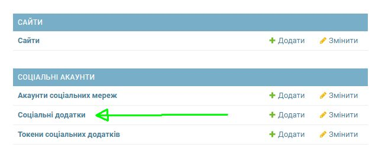
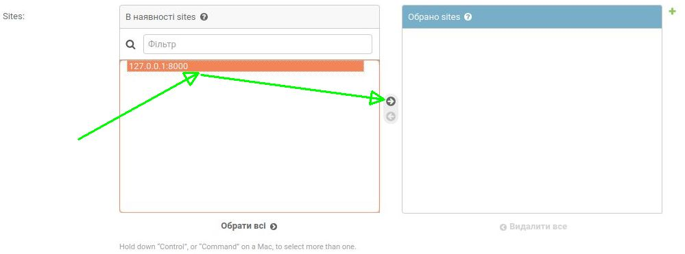

# Data Ocean

-------------------------------------------------------------------------------------------------------------------------
INSTALL ON UBUNTU 18.04 (DEV)
-------------------------------------------------------------------------------------------------------------------------

###### System update and packages install 
- $ `sudo apt update && sudo apt upgrade`
- $ `sudo apt install dkms linux-headers-generic`
- $ `sudo apt install python3-setuptools python3-distutils python3-venv libpq-dev`
- $ `sudo apt install mc htop git`

###### Install PostgreSQL
- $ `sudo apt update`
- $ `sudo apt install postgresql postgresql-contrib`
- $ `psql --version`

###### Create db & user
- $ `sudo -u postgres psql`
- postgres=# `create database your_db_name;`
- postgres=# `create user your_db_user with password 'your_db_password';`
- postgres=# `grant all on database your_db_name to your_db_user;`
- postgres=# `\q`

###### Install Python 3.7
- $ `sudo apt install software-properties-common`
- $ `sudo add-apt-repository ppa:deadsnakes/ppa`
- $ `sudo apt update`
- $ `sudo apt install python3.7`
- $ `python3.7 --version`
- $ `sudo apt install python3.7-dev python3.7-venv`

###### Create Your_Fork on GitHub from official repo 
- https://github.com/3v-workspace/Data_converter

###### WeasyPrint 
https://weasyprint.readthedocs.io/en/stable/install.html
```shell script
sudo apt-get install build-essential python3-dev python3-pip python3-setuptools python3-wheel python3-cffi libcairo2 libpango-1.0-0 libpangocairo-1.0-0 libgdk-pixbuf2.0-0 libffi-dev shared-mime-info
```
Create 2 files in payment_system/credentials directory:
1. uk.txt
2. en.txt

###### Clone Your_Fork repo & create virtual environment & install requirements
- $ `git clone https://github.com/Your_Fork/Data_converter.git`
- $ `cd Data_converter`
- $ `python3.7 -m venv .venv`
- $ `source .venv/bin/activate`
- (.venv)$ `pip install -U pip setuptools wheel`
- (.venv)$ `pip install -r requirements.txt` 

###### Create your settings_local.py 
- Copy **data_converter/settings_local.base.py** to **data_converter/settings_local.py**

###### Setup your settings in settings_local.py 
- Set your credentials from PostgreSQL in DATABASES section
  - "NAME": `"your_db_name"`,
  - "USER": `"your_db_user"`,
  - "PASSWORD": `"your_db_password"`,

###### Migrate
- (.venv)$ `./manage.py migrate`

###### Create Superuser
- (.venv)$ `./manage.py createsuperuser`

###### Load fixtures
- (.venv)$ `./manage.py loaddata category`
- (.venv)$ `./manage.py loaddata register`

###### Collect static files
- (.venv)$ `./manage.py collectstatic`

###### Run server
- (.venv)$ `./manage.py runserver 127.0.0.1:8000`

These were the minimum requirements to get the project up and running quickly.

The rest of the settings are intended for connecting additional features.

-----------------------------------------------------------------------------------------------------
User API endpoint
-----------------------------------------------------------------------------------------------------
- Registration (with email send): `/api/rest-auth/registration/`
- Registration Confirm: `/api/rest-auth/registration-confirm/<int:user_id>/<str:confirm_code>/`
- Login: `/api/rest-auth/login/`
- Logout: `/api/rest-auth/logout/`
- Password Change (with old password): `/api/rest-auth/password/change/`
- Password Reset (with email send): `/api/rest-auth/password/reset/`
- New Password after Password Reset: `/api/rest-auth/password/reset/confirm/<str:UID>/<str:token>/`
-----------------------------------------------------------------------------------------------------
- User list: `/api/users/`
- User Details: `/api/rest-auth/user/`
-----------------------------------------------------------------------------------------------------
- Endpoint for email sending from Landing page: `/api/landing_mail/`
-----------------------------------------------------------------------------------------------------
This user API endpoint works after "Setup Google Login" 
- Social Login: `/api/accounts/login/`
- Social Logout: `/api/accounts/logout/`
-----------------------------------------------------------------------------------------------------

-----------------------------------------------------------------------------------------------------
Local settings options  
-----------------------------------------------------------------------------------------------------

- CANDIDATE_EXPIRE_MINUTES
  - When registering a user, the candidate receives an email with a confirmation link. This variable sets the expiration time for this link. The default is 5 minutes.

- SEND_MAIL_BY_POSTMAN
  - When registering a user or reset password, an email is sent. If this variable is TRUE, the email will be sent via POSTMAN, if FALSE, the EMAIL_BACKEND variable is used. The default is FALSE.
- POSTMAN_TOKEN
  - your Authentication token from https://postman.org.ua/

- EMAIL_BACKEND (https://docs.djangoproject.com/en/3.0/topics/email/#email-backends)
  - Django comes with several backends for sending email. In this project the default is console.EmailBackend (writes to stdout). 
  - If you want to send real letters, you need to use class smtp.EmailBackend and configure the SMTP server.
  
- SUPPORT_EMAIL
  - Email for letters from Landing page.

- CORS_ORIGIN_WHITELIST (https://github.com/adamchainz/django-cors-headers)
  - A list of origins that are authorized to make cross-site HTTP requests

- CSRF_TRUSTED_ORIGINS (https://docs.djangoproject.com/en/3.0/ref/settings/#csrf-trusted-origins)
  - A list of hosts which are trusted origins for unsafe requests, e.g. POST

- CACHES (https://docs.djangoproject.com/en/3.0/topics/cache/)
  - To cache something is to save the result of an expensive calculation so that you don’t have to perform the calculation next time. The default is Dummy caching (for development, implements the cache interface without doing anything).
  - If you want to use real caching, follow the directions in the "Setup Redis" section, comment out the "Dummy Cache for developing" block, uncomment the "REDIS cache configs" block and set your_redis_password.

To monitor errors with logging and receiving errors by email, follow the directions in the "SENTRY" section, uncomment and configure these 3 blocks:
- sentry_sdk.init
- RAVEN_CONFIG (https://raven.readthedocs.io/en/stable/integrations/django.html)
- LOGGING (https://docs.djangoproject.com/en/3.0/topics/logging/)

-----------------------------------------------------------------------------------------------------
Setup Google Login
-----------------------------------------------------------------------------------------------------
**To add Google login on your app, you’ll need to set up OAuth application via Google Developers Console:**
- https://console.developers.google.com/

Getting started
- Go to Dashboard, create a NEW PROJECT

  

- Name your new project. User will be able to see this project name when we redirect them to Google login page.

  

OAuth consent screen
- Choose External User type.

  

- You’ll only need to provide "Application name", "Email" and click "SAVE".

  

APIs Credentials
- Create credentials. On the dropdown, choose "OAuth Client ID" option.

  

Create OAuth client ID
- Now, you can create your OAuth Client ID:

  

- Filling out these details
  - Authorized Javascript origins: `http://127.0.0.1:8000`
  - Authorized redirect URL: `http://127.0.0.1:8000/accounts/google/login/callback/`

Obtain OAuth client
- Once you click "CREATE", you will be able to obtain your "Client ID" and "Client Secret".

  

- You’ll need this information to proceed the next steps

**Go to your admin site:**
- http://127.0.0.1:8000/admin/

Add a site
- On the SITES section, click "SITES":

  

- Fill out the details and click "Save"
  - Domain name: `127.0.0.1:8000`
  - Display name: `127.0.0.1:8000`
  
  

Add social applications
- Back to admin homepage, under "SOCIAL ACCOUNTS" section, click "Social applications":

  

- Fill out these settings
  - Provider: `Google`
  - Name: `MySocialLocalApp`
  - Client id: `your "Client ID"`
  - Secret key: `your "Client Secret"`

  

- Add site

  

  

**Check Google Login result**
- http://127.0.0.1:8000/api/accounts/login/

-----------------------------------------------------------------------------------------------------
Setup Redis
-----------------------------------------------------------------------------------------------------
###### Install Redis
- $ `sudo apt update`
- $ `sudo apt install redis-server`

###### Declare an init system for running Redis as a service
- $ `sudo nano /etc/redis/redis.conf`
  - change "supervised no" to "supervised systemd", save & exit

###### Restart service & Check Status
- $ `sudo systemctl restart redis.service`
- $ `sudo systemctl status redis`

If you prefer to start Redis manually each time the server boots, use the following command:
  - $ `sudo systemctl disable redis`

###### Connect to the server using a client and test
- $ `redis-cli`
- 127.0.0.1:6379> `ping`
  - PONG
- 127.0.0.1:6379> `set test "It's working!"`
  - OK
- 127.0.0.1:6379> `get test`
  - "It's working!"
- 127.0.0.1:6379> `exit`
- $ `sudo systemctl restart redis`
- $ `redis-cli`
- 127.0.0.1:6379> `get test`
  - "It's working!"
- 127.0.0.1:6379> `exit`

###### Bind to localhost
- $ `sudo nano /etc/redis/redis.conf`
  - uncomment string "bind 127.0.0.1 ::1", save & exit
- $ `sudo systemctl restart redis`
- $ `sudo netstat -lnp | grep redis`
  - tcp 0 0 127.0.0.1:6379 0.0.0.0:* LISTEN 14222/redis-server  
  - tcp6 0 0 ::1:6379 :::* LISTEN 14222/redis-server  

###### Password setup
- $ `sudo nano /etc/redis/redis.conf`
  - uncomment string "requirepass foobared" and set your_redis_password instead "foobared", save & exit
- $ `sudo systemctl restart redis.service`

###### Auth test
- $ `redis-cli`
- 127.0.0.1:6379> `set key1 10`
  - (error) NOAUTH Authentication required.
- 127.0.0.1:6379> `auth your_redis_password`
  - OK
- 127.0.0.1:6379> `set key1 10`
  - OK
- 127.0.0.1:6379> `get key1`
  - "10"
- 127.0.0.1:6379> `exit`

###### Set CACHES to Redis in settings_local.py
- uncomment "REDIS cache configs" block, set your_redis_password
- comment "Dummy Cache for developing" block
- restart Django project

-----------------------------------------------------------------------------------------------------
POSTMAN
-----------------------------------------------------------------------------------------------------
Postman is information SAAS-system for guaranteed message send.
- Register on the POSTMAN official site: 
  - https://postman.org.ua/
- Create new project and get your Authentication token

-----------------------------------------------------------------------------------------------------
SENTRY
-----------------------------------------------------------------------------------------------------
Sentry is error monitoring that helps software teams discover, triage, and prioritize errors in real-time.
- Register on the Sentry official site 
  - https://sentry.io/
- Create new project and get your_DSN

-----------------------------------------------------------------------------------------------------
Debugging in VSCode
-----------------------------------------------------------------------------------------------------
Official documentation:
- https://code.visualstudio.com/docs/editor/debugging
